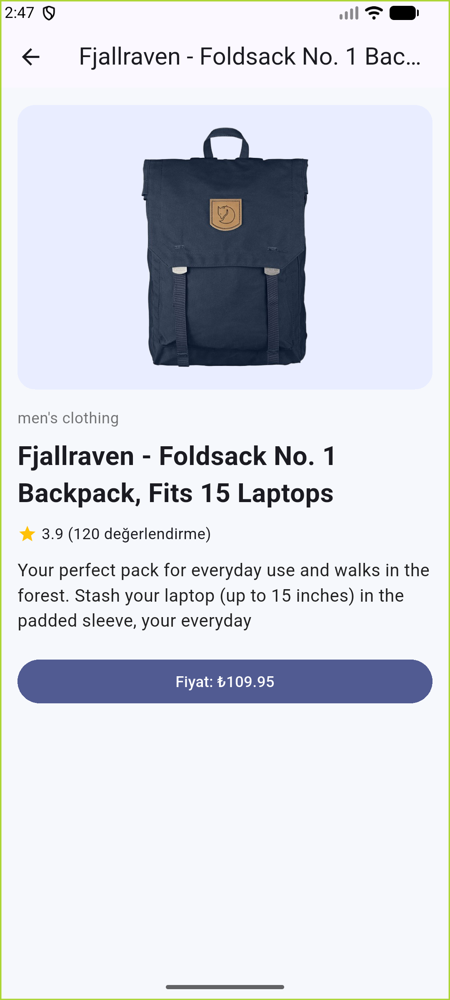
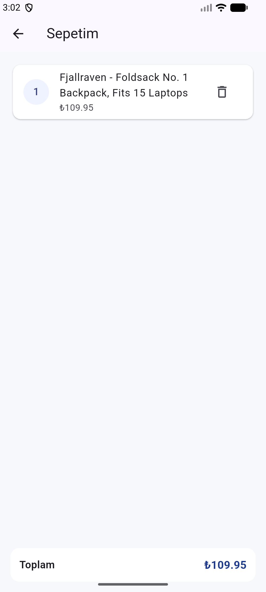
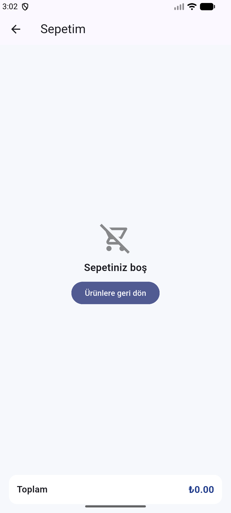

# Mini Katalog Uygulaması

Mini Katalog, Flutter ile geliştirilmiş basit bir ürün listeleme uygulamasıdır.  
Uygulamada ürünler API üzerinden alınır, kart yapısında listelenir ve detay ekranında görüntülenir.

## Uygulama Özellikleri

- Ana sayfada ürünleri GridView ile kart şeklinde gösterme
- Ürün arama (isim ve kategoriye göre filtreleme)
- Hızlı filtre kartları (Yeni Ürünler, İndirimdekiler, Sepetim, Diğer)
- Ürün detay ekranına geçiş
- Sepete ürün ekleme/çıkarma ve toplam tutar hesaplama
- Sepet ekranında seçilen ürünleri listeleme ve silme

## Kullanılan Yapılar

- Flutter Material 3
- Named Route ve Route Arguments
- HTTP ile Fake Store API entegrasyonu
- Basit state yönetimi (`setState`)
- Asset kullanımı (etiket verileri)

## Çalıştırma

```bash
flutter pub get
flutter run
```

## Not

API erişiminde bir sorun olursa uygulama, yerel örnek verilerle çalışmaya devam eder.

## Ekran Görüntüleri

### 1) Ana Sayfa
Uygulamanın açılış ekranı, hızlı işlem kartları ve ürün listesi bu bölümde görünür.



### 2) Yeni Ürünler Filtresi
Yeni Ürünler kartına basıldığında ürünler filtrelenir ve liste buna göre güncellenir.


### 3) Arama
Arama kutusu ile ürün adı veya kategoriye göre anlık filtreleme yapılır.


### 4) Ürün Detay
Seçilen ürünün görseli, açıklaması, puanı ve fiyatı detay ekranında gösterilir.


### 5) Sepete Ekleme
Ürün kartındaki butonla ürün sepete eklenir ve üstteki sepet sayacı güncellenir.


### 6) Sepet Ekranı
Sepete eklenen ürünler listelenir, toplam tutar alt bölümde gösterilir.



### 7) Boş Sepet
Sepette ürün yoksa boş sepet durumu ve geri dönüş aksiyonu gösterilir.


